<div align="center">

# CORES

CORES is a Course Registration System, having two panels, i.e. for Admin and Students. 

Admin has options to manage other admins, students and courses. There are various filters to sort and search the data in the app. Also, the app provides an option to upload data via a `.xlsx` file rather than manually adding the data. 

From the student's point of view, CoReS let them register for courses so that students do need not register for core courses explicitly. All students need to do is save elective courses so they can't select courses of the same group (the save button gets disabled once we have saved a course of a particular group). Later, students can change their selection until the registration process is going on, which is controlled by the admin.

CORES is a user friendly and complete application for course registration and is available for Institutes.


[Download APK](#Download-APK) • [How to Use](#how-to-use) • [Screen Shots](#screen-shots) • [Libraries & Tools Used](#libraries--tools-used) •  [Folder Structure](#folder-structure) • [Routes](#routes) • [Main](#main) • [Backend](#backend) 

</div>


## Download APK
You can download the latest installable version of CORES for Android: [cores.apk](https://drive.google.com/file/d/1B30qAOKGvLq0E8BGGns3bkSjQkHBR8G9/view?usp=sharing)


## How to Use 

**Step 1:**

Download or clone this repo by using the link below:

```
https://github.com/Abhishekkr3003/Course-Registration.git
```

**Step 2:**

Go to project root and execute the following command in console to get the required dependencies: 

```
flutter pub get 
```

**Step 3:**

Connect your device and run:

```
flutter run 
```


### Screen Shots
<table>
  
  <tr>
    <td></td>
    <td>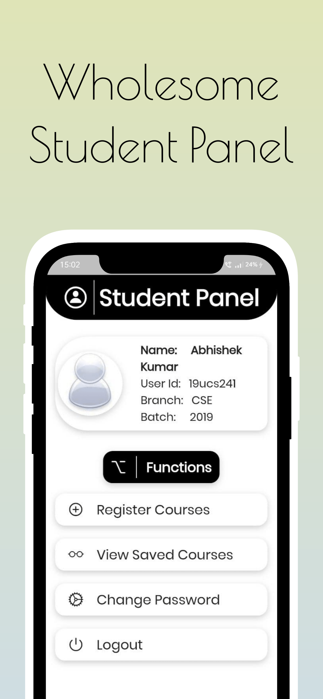</td>
    <td></td>
  </tr>
  <tr>
    <td></td>
    <td>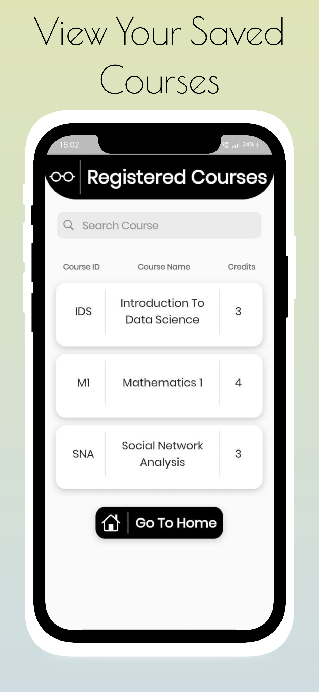</td>
    <td></td>
  </tr>
  <tr>
    <td></td>
    <td>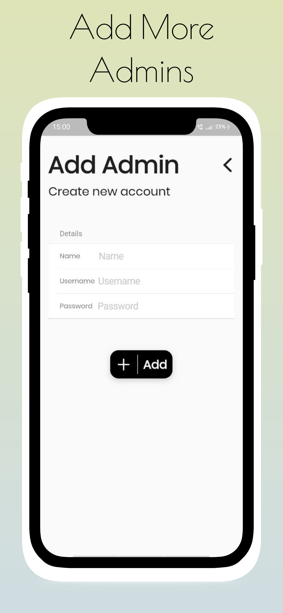</td>
    <td>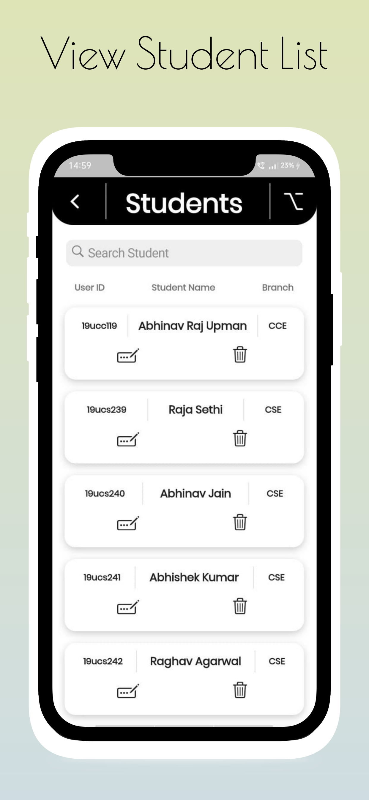</td>
  </tr>
  <tr>
    <td>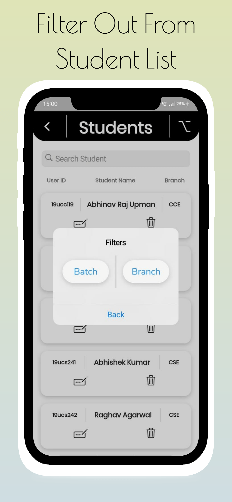</td>
    <td>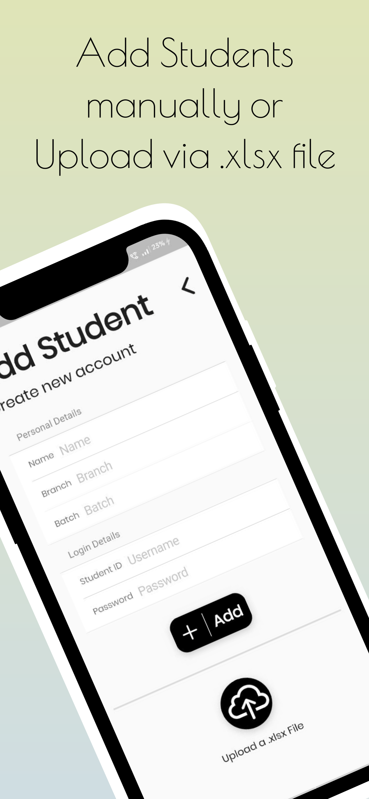</td>
    <td>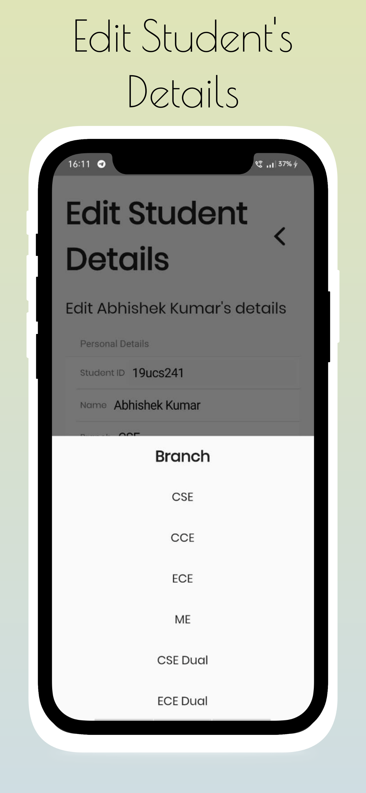</td>
  </tr>
  <tr>
    <td></td>
    <td>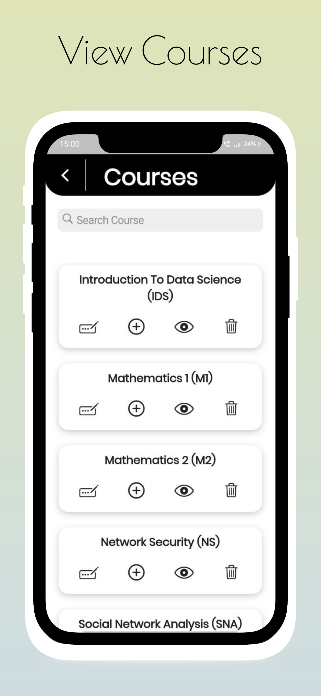</td>
    <td>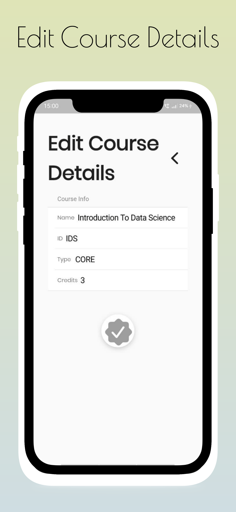</td>
  </tr>
  <tr>
    <td>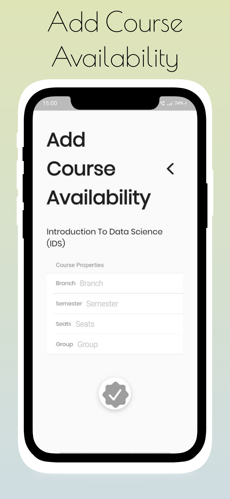</td>
    <td>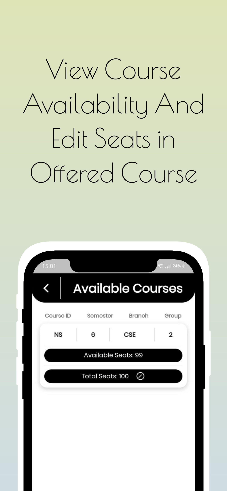</td>
    <td>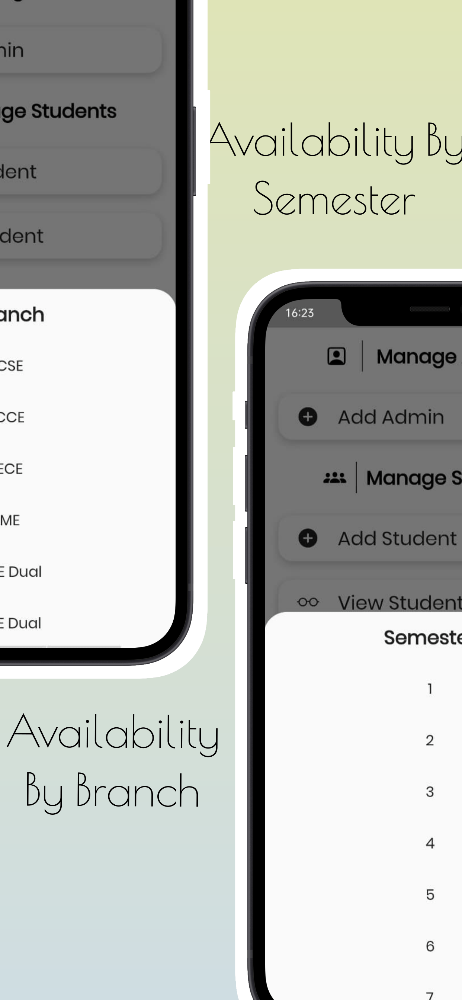</td>
  </tr><tr>
    <td></td>
    <td>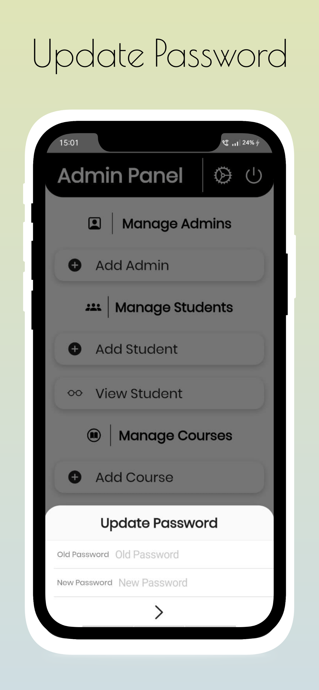</td>
  </tr>

 </table>


### Libraries & Tools Used

* [Dio](https://github.com/flutterchina/dio)
* [VelocityX](https://github.com/iampawan/VelocityX)
* [Cupertino_Icons](https://github.com/flutter/packages/tree/master/third_party/packages/cupertino_icons)
* [File_Picker](https://github.com/miguelpruivo/flutter_file_picker)
* [FlutterToast](https://github.com/PonnamKarthik/FlutterToast)
* [Google Fonts](https://github.com/material-foundation/google-fonts-flutter/)

### Folder Structure
Here is the core folder structure which flutter provides.

```
flutter-app/
|- android
|- assets
|- build
|- ios
|- lib
|- test
|- web
```

Here is the folder structure we have been using in this project

```
lib/
|- Pages/
        |- add_admin.dart
        |- add_available_course.dart
        |- add_course_admin.dart
        |- add_course_core.dart
        |- add_course_elective.dart
        |- add_student.dart
        |- admin_home.dart
        |- edit_courses.dart
        |- edit_student.dart
        |- list_student.dart
        |- login.dart
        |- manage_student.dart
        |- splash_screen.dart
        |- student_home_page.dart
        |- view_avlb_courses.dart
        |- view_courses.dart
|- Stores/
        |- admin.dart
        |- course_availability_class.dart
        |- course.dart
        |- my_store.dart
        |- student.dart
|- Utils/
        |- routes.dart
|- main.dart
```

### Routes

This file contains all the routes for your application.

```dart
import 'package:flutter/material.dart';
import 'package:flutter_application_1/Pages/add_admin.dart';
import 'package:flutter_application_1/Pages/add_course_admin.dart';
import 'package:flutter_application_1/Pages/add_course_core.dart';
import 'package:flutter_application_1/Pages/add_course_elective.dart';
import 'package:flutter_application_1/Pages/add_student.dart';
import 'package:flutter_application_1/Pages/admin_home.dart';
import 'package:flutter_application_1/Pages/list_student.dart';
import 'package:flutter_application_1/Pages/login.dart';
import 'package:flutter_application_1/Pages/manage_student.dart';
import 'package:flutter_application_1/Pages/registered_course.dart';
import 'package:flutter_application_1/Pages/student_home_page.dart';
import 'package:flutter_application_1/Pages/view_avlb_courses.dart';
import 'package:flutter_application_1/Pages/view_courses.dart';

class MyRoutes {
  static const String loginPage = "/loginPage";
  static const String adminHomePage = '/adminHomePage';
  static const String addStudent = '/addStudnet';
  static const String viewStudent = '/viewStudent';
  static const String listStudent = '/listStudent';
  static const String editStudent = '/editStudent';
  static const String addCourse = '/addCourse';
  static const String editCourse = '/editCourse';
  static const String viewCourse = '/viewCourse';
  static const String addAdmin = '/addAdmin';
  static const String studentHomePage = '/studentHomePage';
  static const String addCoreCourse = '/addCoreCourse';
  static const String addElectiveCourse = '/addElectiveCourse';
  static const String viewRegisteredCourse = '/viewRegisteredCourse';
  static const String addAvlbCourses = '/addAvlbCourses';
  static const String viewAvlbCourses = '/viewAvlbCourses';

  static final routes = <String, WidgetBuilder>{
    loginPage: (context) => const LoginPage(),
    adminHomePage: (context) => const AdmHome(),
    addStudent: (context) => const AddStudent(),
    viewStudent: (context) => const ManageStudent(),
    listStudent: (context) => const StuDet(),
    addCourse: (context) => const AddCourseAdm(),
    viewCourse: (context) => const ViewCourses(),
    addAdmin: (context) => const AddAdmin(),
    studentHomePage: (context) => const StuHome(),
    addElectiveCourse: (context) => const AddCourseElective(),
    addCoreCourse: (context) => const AddCourseCore(),
    viewRegisteredCourse: (context) => const RegisteredCourse(),
    viewAvlbCourses: (context) => const ViewAvlbCourses(),
  };
}

```

### Main

This is the starting point of the application. All the application level configurations are defined in this file i.e, theme, routes, title, orientation etc.

```dart
import 'package:flutter/material.dart';
import 'package:flutter_application_1/Stores/my_store.dart';
import 'package:flutter_application_1/Pages/splash_screen.dart';
import 'package:google_fonts/google_fonts.dart';
import 'package:velocity_x/velocity_x.dart';
import 'package:flutter_application_1/Utils/routes.dart';

void main() { 
  runApp(VxState(store: MyStore(), child: const MyApp()));
}

class MyApp extends StatelessWidget {
  const MyApp({Key? key}) : super(key: key);

  // This widget is the root of your application.
  @override
  Widget build(BuildContext context) {
    return MaterialApp(
      debugShowCheckedModeBanner: false,
      theme: ThemeData(
        textTheme: GoogleFonts.poppinsTextTheme(
          Theme.of(context).textTheme,
        ),
      ),
      home: const Splash2(),
      routes: MyRoutes.routes,
    );
  }
}
```

## Backend

API: [Cores-API](https://github.com/Abhishekkr3003/Cores-API)

Database: MySQL ([More details](https://github.com/Abhishekkr3003/Cores-API))

